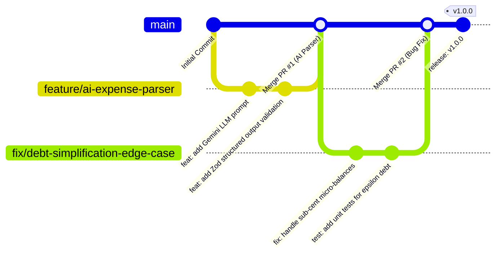

# Git Workflow & Engineering Practices — SplitUp

## 1. Overview
This document outlines the **Git Workflow standards** applied across the **SplitUp** codebase to ensure clean version control, collaborative traceability, and reliable production releases.

Concept: **Engineering Practices — Git workflow (Score: 0.3, Mandatory)**

---

## 2. Branching Strategy (GitHub Flow)

SplitUp follows the industry-standard **GitHub Flow model**:



### Branch Naming Conventions:
- `feature/<feature-name>`: For new capabilities (e.g., `feature/qr-invite-modal`, `feature/bell-notifications`).
- `fix/<bug-description>`: For bug fixes (e.g., `fix/css-selector-typo`, `fix/debt-simplification-bounds`).
- `docs/<doc-title>`: For documentation updates (e.g., `docs/prd-hld-lld-update`).
- `refactor/<module-name>`: For performance optimization or code cleanup without changing external behavior.

---

## 3. Conventional Commit Guidelines

Commits follow the **Conventional Commits specification** (`<type>(<scope>): <subject>`):

| Type | Purpose | Example |
|---|---|---|
| `feat` | New user-facing feature | `feat(groups): add QR code invite link sharing` |
| `fix` | Bug fix in code | `fix(dashboard): correct notification dot display on 0 pending requests` |
| `docs` | Documentation changes | `docs: add comprehensive PRD, HLD, LLD, and PROJECT_SCORE viva mapping` |
| `test` | Adding or updating unit/integration tests | `test: add unit tests for event loop and debt simplification algorithm` |
| `refactor` | Code refactoring without behavioral change | `refactor(balances): optimize greedy debt simplification pass` |
| `chore` | Maintenance tasks or dependency updates | `chore: update prisma client and configure npm test script` |

---

## 4. Pull Request & Code Review Workflow
1. **Branch Isolation:** Developers branch off `main` and work in isolated feature branches.
2. **Atomic Commits:** Each commit represents a single logical unit of work with clear context.
3. **Automated Verification:** Before opening a PR, the automated test suite and build must pass:
   ```bash
   npm test        # Runs unit tests (Node.js test runner)
   cd frontend && npm run build  # Validates React/Vite bundle compilation
   ```
4. **Code Review:** PRs are reviewed for:
   - Security vulnerabilities & input validation (Zod schemas).
   - Database migration integrity (Prisma schema & transactional boundaries).
   - UX/UI adherence to design tokens.
5. **Squash & Merge:** Merged into `main` with clean commit messages.

---

## 5. Security & Hygiene (.gitignore & Secrets Management)
- **Secrets Isolation:** `.env` files containing `DATABASE_URL`, `JWT_SECRET`, or `GROQ_API_KEY` are strictly excluded in `.gitignore`.
- **Clean Artifacts:** `node_modules/`, `dist/`, `.vite/`, and `.system_generated/` are never committed to the remote repository.
