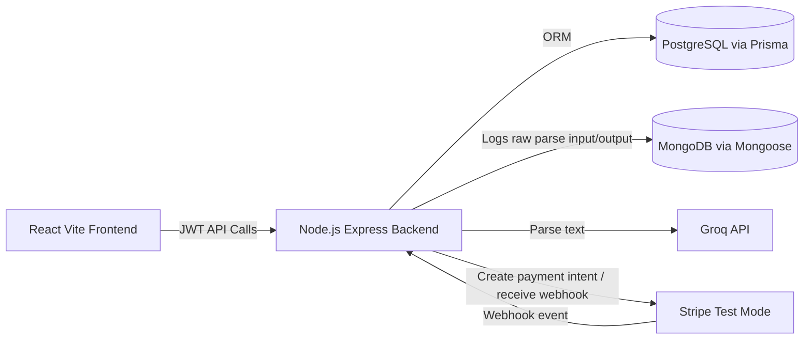

# SplitUp HLD

## Architecture Flow

## Component Interactions
- Frontend authenticates via `/api/auth/login` and stores JWT.
- Frontend calls protected group/expense/balance routes with Bearer token.
- Backend stores relational entities in PostgreSQL: users, groups, memberships, expenses, splits, settlements.
- Backend sends free-form expense text to Groq and validates structured output.
- Backend stores raw AI parse logs in MongoDB for flexible, variable payload auditing.
- Backend creates Stripe payment intents for settlement edges and updates status by webhook.

## Key Design Decisions
- Two databases:
  - PostgreSQL holds strongly relational and transactional records.
  - MongoDB holds variable-structure AI parse logs without rigid migrations.
- Greedy debt simplification:
  - Efficiently matches largest debtor and creditor each step.
  - Complexity is dominated by sorting: O(n log n), practical for group size workloads.
