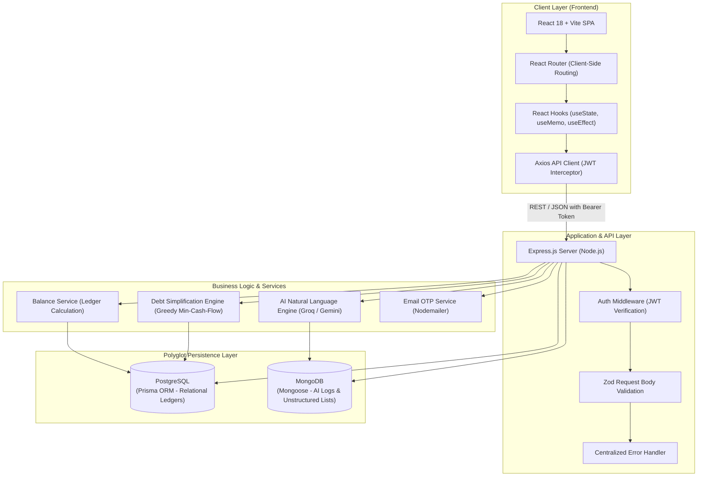
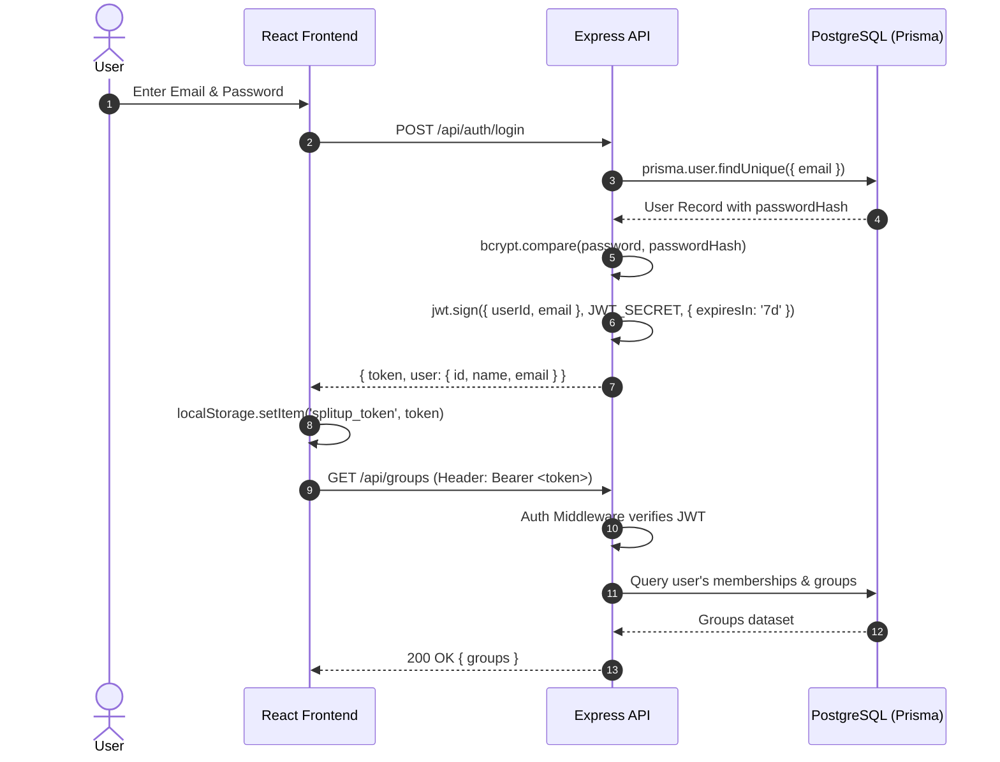
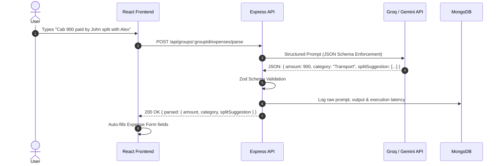

# High-Level Design (HLD) — SplitUp

## 1. System Architecture

---

## 2. Polyglot Persistence Architecture

SplitUp employs a **Polyglot Persistence strategy** matching specific workload access patterns to the optimal database engine:

| Attribute | PostgreSQL (Prisma ORM) | MongoDB (Mongoose ODM) |
|---|---|---|
| **Data Scope** | Users, Groups, GroupMembers, Expenses, Splits, Settlements, OTPs | AI Free-Form Parse Logs, Shared Shopping Lists |
| **Data Model** | Relational, strict foreign keys, cascade deletes, composite indexes | Document / JSON collections, schema flexibility |
| **Consistency** | Strong ACID transactional guarantees (`prisma.$transaction`) | Eventual / Flexible write consistency |
| **Rationale** | Financial balance sheets and debts must never suffer from partial writes or orphan records. | AI prompt inputs, raw model token outputs, and ad-hoc shopping items have variable schemas. |

---

## 3. End-to-End Sequence Workflows

### 3.1 Authentication & Protected Route Access

### 3.2 AI Natural Language Expense Parsing

---

## 4. Key Engineering & Algorithmic Decisions

### 4.1 Greedy Debt Simplification Algorithm
- **Problem:** In a group with $N$ members, pairwise expense tracking produces up to $\frac{N(N-1)}{2}$ debt relationships (a dense graph of $O(N^2)$ transactions).
- **Solution:** Reduce the transaction graph into net balances ($\text{Net}_i = \text{TotalPaid}_i - \text{TotalOwed}_i$).
- **Algorithm:**
  1. Separate users into `creditors` ($\text{Net} > 0$) and `debtors` ($\text{Net} < 0$).
  2. Sort creditors and debtors in descending order of absolute magnitude.
  3. Greedily match the largest creditor with the largest debtor, settling $\min(\text{credit}, \text{debt})$.
  4. Deduct the settled amount and advance pointers.
- **Complexity:**
  - Sorting: $O(N \log N)$
  - Two-pointer greedy sweep: $O(N)$
  - Max settlements generated: at most $N-1$ transactions.

---

## 5. Security & Failure Resilience
1. **Password Security:** Salted and hashed using `bcrypt` (10 salt rounds). Plaintext passwords are never stored or logged.
2. **Payload Protection:** Zod validators enforce strict types, bounds, positive numeric limits, and array structures before controller logic executes.
3. **Graceful Database Fallback:** If MongoDB is temporarily offline, Express gracefully logs a warning and continues serving core transactional ledger endpoints via PostgreSQL.
4. **Relational Cascade Safety:** Foreign key constraints guarantee that deleting a group cleanly purges dependent splits, expenses, and settlements in transactional sequence.
