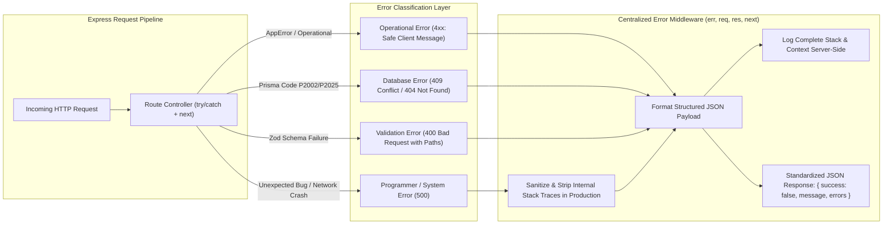
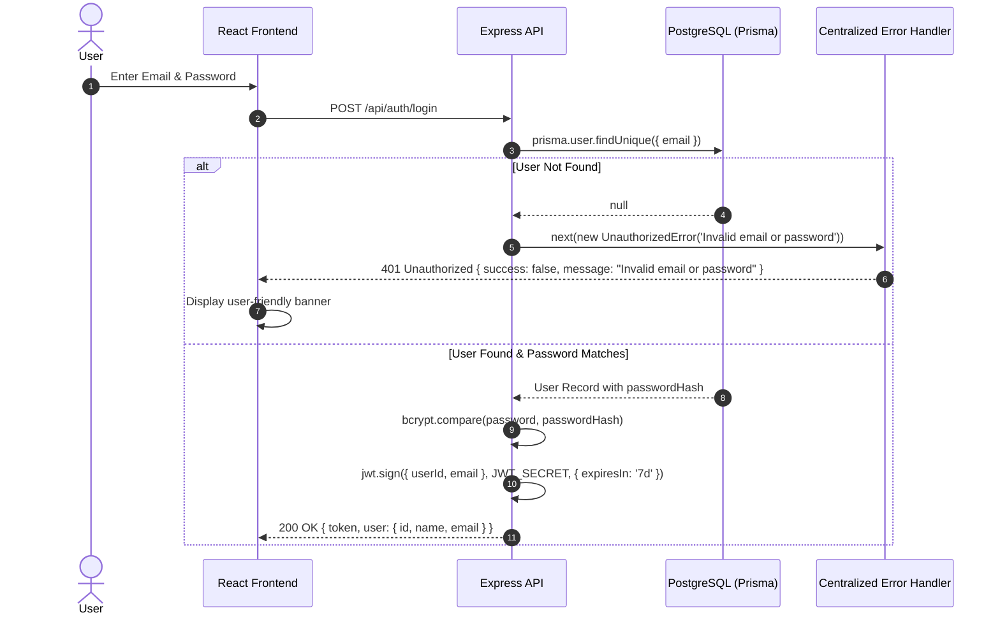
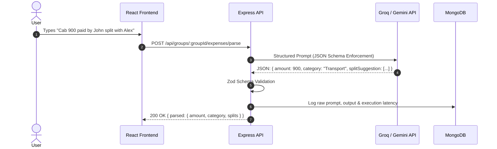

# High-Level Design (HLD) — SplitUp

## 1. System Architecture

```mermaid
flowchart TD
  subgraph Client_Layer ["Client Layer (Frontend)"]
    UI["React 18 + Vite SPA"]
    Router["React Router (Client-Side Routing)"]
    State["React Hooks (useState, useMemo, useEffect)"]
    AxiosInstance["Axios API Client (JWT Interceptor & Error Retry)"]
    UI --> Router --> State --> AxiosInstance
  end

  subgraph Gateway_Layer ["Application & API Layer"]
    ExpressApp["Express.js Server (Node.js)"]
    SanitizeMW["Input Sanitization Middleware (XSS/NoSQL Defenses)"]
    AuthMW["Auth Middleware (JWT Verification)"]
    ZodVal["Zod Request Body Validation"]
    NotFoundMW["404 Catch-All Middleware"]
    CentralErrorHandler["Centralized Express Error Handler (4-Arity)"]
    ProcessGuards["Process Crash Guards (unhandledRejection / uncaughtException)"]
    
    ExpressApp --> SanitizeMW --> AuthMW --> ZodVal
    ZodVal -.->|Validation Error (400)| CentralErrorHandler
    AuthMW -.->|Auth Error (401/403)| CentralErrorHandler
    ExpressApp --> NotFoundMW --> CentralErrorHandler
  end

  subgraph Services_Layer ["Business Logic & Services"]
    BalanceSvc["Balance Service (Ledger Calculation)"]
    DebtAlg["Debt Simplification Engine (Greedy Min-Cash-Flow)"]
    AISvc["AI Natural Language Engine (Groq / Gemini)"]
    EmailSvc["Email OTP Service (Nodemailer)"]
    CronSvc["Cron Retention Service (TTL / Cleanup)"]
  end

  subgraph Storage_Layer ["Polyglot Persistence Layer"]
    PG[("PostgreSQL\n(Prisma ORM - Relational Ledgers)")]
    Mongo[("MongoDB\n(Mongoose - AI Logs & Unstructured Lists)")]
  end

  AxiosInstance -->|REST / JSON with Bearer Token| ExpressApp
  ExpressApp --> BalanceSvc & DebtAlg & AISvc & EmailSvc & CronSvc
  BalanceSvc & DebtAlg --> PG
  AISvc --> Mongo
  ExpressApp --> PG
  ExpressApp --> Mongo
  Services_Layer -.->|Caught Exception| CentralErrorHandler
```

---

## 2. Polyglot Persistence Architecture

SplitUp employs a **Polyglot Persistence strategy** matching specific workload access patterns to the optimal database engine:

| Attribute | PostgreSQL (Prisma ORM) | MongoDB (Mongoose ODM) |
|---|---|---|
| **Data Scope** | Users, Groups, GroupMembers, Expenses, Splits, Settlements, OTPs | AI Free-Form Parse Logs, Shared Shopping Lists |
| **Data Model** | Relational, strict foreign keys, cascade deletes, composite indexes | Document / JSON collections, schema flexibility |
| **Consistency** | Strong ACID transactional guarantees (`prisma.$transaction`) | Eventual / Flexible write consistency |
| **Rationale** | Financial balance sheets and debts must never suffer from partial writes or orphan records. | AI prompt inputs, raw model token outputs, and ad-hoc shopping items have variable schemas. |

---

## 3. Server-Side Error Handling & Fault Tolerance Architecture



### Core Architectural Pillars:
1. **Operational vs Programmer Error Separation:**
   - **Operational Errors (`isOperational: true`):** Expected user/client mistakes (e.g. invalid password, group not found, insufficient permissions, split mismatch). Returned with accurate semantic HTTP status codes (`400`, `401`, `403`, `404`, `409`).
   - **Programmer Errors (`isOperational: false`):** Unexpected bugs, syntax errors, or third-party network disconnects. Logged in detail server-side and returned as sanitized `500 Internal Server Error`.
2. **Specialized Error Mappers:**
   - **Prisma ORM Codes:** `P2002` mapped to `409 Conflict`, `P2025` mapped to `404 Not Found`, `P2003`/`P2014` mapped to `400 Bad Request`.
   - **Zod Validation:** Formatted into `{ path: "amount", message: "amount must be positive" }` with HTTP `400`.
   - **JWT Tokens:** `TokenExpiredError` and `JsonWebTokenError` mapped to `401 Unauthorized`.
   - **Malformed JSON:** Body parsing syntax errors mapped to `400 Bad Request`.
3. **Information Leakage Defense:**
   - Client responses in production strictly omit SQL queries, internal directory paths, and stack traces.
4. **Process Crash Guards:**
   - Global `unhandledRejection` and `uncaughtException` listeners prevent Node.js worker crashes while logging root causes.

---

## 4. End-to-End Sequence Workflows

### 4.1 Authentication & Error Propagation


### 4.2 AI Natural Language Expense Parsing

