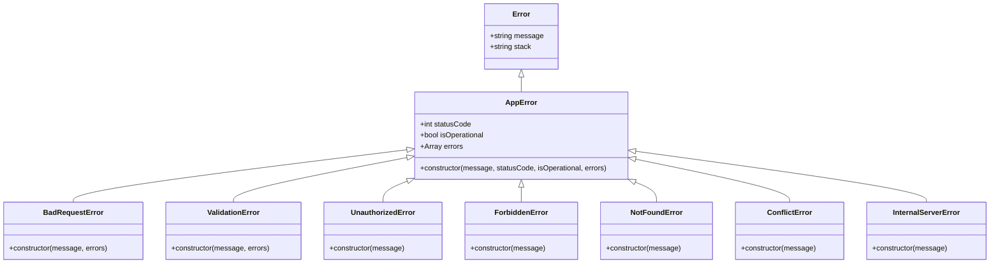

# Low-Level Design (LLD) — SplitUp

## 1. Database Schema & Data Models

### 1.1 PostgreSQL Relational Models (via Prisma ORM)

```prisma
model User {
  id               String        @id @default(cuid())
  name             String
  email            String        @unique
  passwordHash     String
  phone            String?
  upiId            String?
  emailVerified    Boolean       @default(false)
  createdAt        DateTime      @default(now())

  groupMemberships GroupMember[]
  adminOfGroups    Group[]       @relation("GroupAdmin")
  joinRequests     JoinRequest[]
  paidExpenses     Expense[]     @relation("ExpensePaidBy")
  expenseSplits    ExpenseSplit[]
  settlementsFrom  Settlement[]  @relation("SettlementFrom")
  settlementsTo    Settlement[]  @relation("SettlementTo")
  confirmedSettlements Settlement[] @relation("SettlementConfirmedBy")
  otpCodes         OtpCode[]
  shoppingItems    ShoppingItem[]
}

model Group {
  id            String         @id @default(cuid())
  name          String
  adminId       String
  createdAt     DateTime       @default(now())

  admin         User           @relation("GroupAdmin", fields: [adminId], references: [id], onDelete: Restrict)
  members       GroupMember[]
  expenses      Expense[]
  settlements   Settlement[]
  joinRequests  JoinRequest[]
  shoppingItems ShoppingItem[]
}

model GroupMember {
  userId  String
  groupId String

  user    User  @relation(fields: [userId], references: [id], onDelete: Cascade)
  group   Group @relation(fields: [groupId], references: [id], onDelete: Cascade)

  @@id([userId, groupId])
}

model Expense {
  id          String        @id @default(cuid())
  groupId     String
  paidById    String
  amount      Decimal       @db.Decimal(12, 2)
  category    String
  description String?
  createdAt   DateTime      @default(now())

  group       Group         @relation(fields: [groupId], references: [id], onDelete: Cascade)
  paidBy      User          @relation("ExpensePaidBy", fields: [paidById], references: [id], onDelete: Restrict)
  splits      ExpenseSplit[]
  editHistory ExpenseEditHistory[]
}

model ExpenseSplit {
  id         String   @id @default(cuid())
  expenseId  String
  userId     String
  share      Decimal  @db.Decimal(12, 2)

  expense    Expense  @relation(fields: [expenseId], references: [id], onDelete: Cascade)
  user       User     @relation(fields: [userId], references: [id], onDelete: Cascade)

  @@unique([expenseId, userId])
}

model Settlement {
  id            String    @id @default(cuid())
  groupId       String
  fromId        String
  toId          String
  amount        Decimal   @db.Decimal(12, 2)
  status        String    @default("pending") // "pending" | "pending_confirmation" | "completed" | "rejected"
  rejectionReason String?
  paidAt        DateTime?
  confirmedById String?
  confirmedAt   DateTime?
  createdAt     DateTime  @default(now())

  group         Group     @relation(fields: [groupId], references: [id], onDelete: Cascade)
  from          User      @relation("SettlementFrom", fields: [fromId], references: [id], onDelete: Cascade)
  to            User      @relation("SettlementTo", fields: [toId], references: [id], onDelete: Cascade)
  confirmedBy   User?     @relation("SettlementConfirmedBy", fields: [confirmedById], references: [id], onDelete: SetNull)
}
```

---

## 2. Server-Side Error Handling Architecture (Low-Level Design)

### 2.1 Custom Error Class Hierarchy



### 2.2 Standardized JSON Error Response Schema

All API error responses adhere to a consistent contract:
```json
{
  "success": false,
  "code": 400,
  "message": "Human-readable operational error message",
  "errors": [
    {
      "path": "splits.0.share",
      "message": "share must be a positive number"
    }
  ]
}
```

### 2.3 HTTP Status Code Translation Matrix

| Error Condition / Trigger | Mapped Status Code | Error Class / Handler | Sanitized Client Message |
|---|---|---|---|
| Zod validation schema failure | `400 Bad Request` | `ValidationError` | `"Request validation failed"` + field path array |
| Unbalanced split shares | `400 Bad Request` | `BadRequestError` | `"Splits must sum to the total expense amount"` |
| Malformed JSON body | `400 Bad Request` | Body Parser Handler | `"Malformed JSON payload in request body"` |
| Missing / invalid JWT token | `401 Unauthorized` | `UnauthorizedError` | `"Authentication token invalid or expired"` |
| Non-member accessing private group | `403 Forbidden` | `ForbiddenError` | `"You are not a member of this group"` |
| Non-admin deleting group | `403 Forbidden` | `ForbiddenError` | `"Only the group admin can delete this group"` |
| Group / Expense / User not found | `404 Not Found` | `NotFoundError` | `"Requested resource not found"` |
| Undefined endpoint route | `404 Not Found` | `notFoundHandler` | `"Cannot {METHOD} {PATH}"` |
| Duplicate email registration (Prisma P2002) | `409 Conflict` | `ConflictError` | `"Email is already registered"` |
| Unexpected DB crash / unhandled bug | `500 Server Error` | `InternalServerError` | `"Internal server error. Please try again later."` |

---

## 3. Core Algorithms & Logic

### 3.1 Debt Simplification Algorithm (Greedy Min-Cash-Flow)

```javascript
// services/debtSimplification.js
function simplifyDebts(balances) {
  const EPSILON = 0.01;
  const creditors = [];
  const debtors = [];

  for (const b of balances) {
    const net = Number(b.netBalance) || 0;
    if (net > EPSILON) creditors.push({ userId: b.userId, amount: net });
    else if (net < -EPSILON) debtors.push({ userId: b.userId, amount: -net });
  }

  // Sort descending by magnitude: O(N log N)
  creditors.sort((a, b) => b.amount - a.amount);
  debtors.sort((a, b) => b.amount - a.amount);

  const settlements = [];
  let i = 0, j = 0;

  // Two-pointer matching: O(N)
  while (i < creditors.length && j < debtors.length) {
    const amount = Math.min(creditors[i].amount, debtors[j].amount);
    settlements.push({
      from: debtors[j].userId,
      to: creditors[i].userId,
      amount: Number(amount.toFixed(2)),
    });

    creditors[i].amount -= amount;
    debtors[j].amount -= amount;

    if (creditors[i].amount <= EPSILON) i++;
    if (debtors[j].amount <= EPSILON) j++;
  }

  return settlements;
}
```

---

## 4. Frontend Architecture & Component Hierarchy

```
<App>
 ├── <ProtectedRoute>
 │    └── <AppLayout>
 │         ├── <AppSidebar> (Groups list, Loading Skeletons, Error Banner with ↻ Retry)
 │         └── <Routes>
 │              ├── <DashboardPage> (Groups Grid, Top-right Bell Notification Icon & Modal)
 │              ├── <GroupDetailPage> (Expense Ledger, Add Expense Modal, AI Natural Language Parser)
 │              └── <BalancesPage> (Net Balances, Simplified Settlements, UPI QR Generator, History)
 └── <PublicRoutes>
      ├── <LoginPage>
      ├── <RegisterPage>
      ├── <VerifyEmailPage>
      └── <JoinRequestPage> (Invite Link Preview, QR Scan landing page)
```

---

## 5. Automated Testing Strategy
Unit tests executed using Node.js Native Test Runner (`node:test`):
- `src/__tests__/debtSimplification.test.js`: Validates 0-balance groups, 2-person settlements, 3-person multi-debtor graph reductions.
- `src/__tests__/servicesAndSecurity.test.js`: Validates centralized server error handler, status code translations, production error sanitization, Zod formatting, and JWT lifecycle.
- Command: `npm test` (36 passing unit tests).
