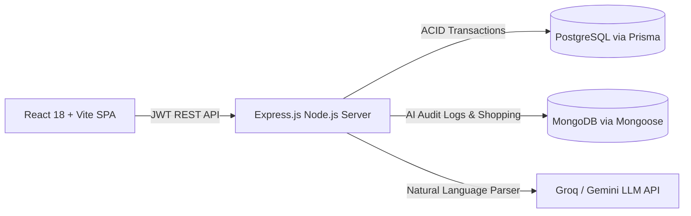

# SplitUp 💸

> **Smart, Minimal & High-Trust Group Expense Sharing with AI Natural Language Parsing & Debt Simplification.**

[](https://github.com/jovabsabus130-alt/splitup)
[](https://nodejs.org)
[](https://www.prisma.io/)
[](https://www.mongodb.com/)
[](https://react.dev)

---

## 📖 Table of Contents
1. [Overview](#overview)
2. [Key Features](#key-features)
3. [Architecture & Polyglot Persistence](#architecture--polyglot-persistence)
4. [Tech Stack](#tech-stack)
5. [Getting Started](#getting-started)
6. [Running Tests](#running-tests)
7. [API Reference](#api-reference)

---

## 🚀 Overview
**SplitUp** eliminates the friction and awkwardness of sharing group costs for roommates, travel groups, and event organizers. It calculates real-time net balances, reduces complex debt webs into minimum cash-flow transactions, and lets users enter expenses effortlessly using natural language powered by LLMs.

---

## ✨ Key Features
- 👥 **Group Management & Moderation:** Create groups, generate instant shareable invite links with dynamic **QR Codes**, and moderate incoming member requests via an interactive **Bell Notification queue**.
- 🧾 **Flexible Multi-Member Splits:** Split expenses equally or by exact shares with member exclusion checkboxes and a **Live Remaining Balance Indicator**.
- ⚖️ **Algorithmic Debt Simplification:** Graph reduction algorithm ($O(N \log N)$) converting dense $O(N^2)$ bilateral debts into minimal settlement transfers.
- 🤖 **AI Natural Language Parsing:** Type free-form text like *"Cab ₹900 paid by John split with Alex and Sarah"* — our LLM pipeline automatically structures the amount, category, and split ratios.
- 🛒 **Shared Collaborative Shopping List:** Real-time group shopping checklist with item prices.

---

## 🏛️ Architecture & Polyglot Persistence



- **PostgreSQL (Prisma ORM):** Primary transactional datastore for Users, Groups, Expenses, Splits, and Settlements ensuring strict ACID compliance.
- **MongoDB (Mongoose ODM):** Document datastore for unstructured AI prompt logs, model token metrics, and collaborative shopping lists.

---

## 📚 Documentation

SplitUp includes complete engineering documentation:

- 📄 [**PRD.md**](./PRD.md) — Product Requirements Document (Problem statement, personas, user journeys, functional & non-functional requirements).
- 📐 [**HLD.md**](./HLD.md) — High-Level Design (System architecture diagrams, sequence workflows, polyglot persistence rationale).
- 🔧 [**LLD.md**](./LLD.md) — Low-Level Design (Database schemas, API specifications, algorithmic design, component hierarchy).
---

## 🛠️ Tech Stack

| Layer | Technologies |
|---|---|
| **Frontend** | React 18, Vite, React Router v6, Axios, Vanilla CSS (Design System) |
| **Backend** | Node.js, Express.js, Zod (Schema Validation), JWT, bcrypt |
| **Databases** | PostgreSQL (via Prisma ORM) + MongoDB (via Mongoose) |
| **AI Engine** | Google Gemini API / Groq API (JSON Object Mode) |
| **Testing** | Node.js Native Test Runner (`node:test`, `node:assert`) |

---

## ⚡ Getting Started

### 1. Prerequisites
- Node.js $\ge 18.0.0$
- PostgreSQL Database
- MongoDB Database (Optional for AI logs)

### 2. Clone and Setup Environment
```bash
git clone https://github.com/jovabsabus130-alt/splitup.git
cd splitup

# Backend environment setup
cp .env.example .env
# Fill in DATABASE_URL, JWT_SECRET, GROQ_API_KEY / GEMINI_API_KEY in .env

# Frontend environment setup
cd frontend
cp .env.example .env
cd ..
```

### 3. Install Dependencies & Migrate Database
```bash
# Install backend dependencies
npm install

# Push database schema
npx prisma db push
npx prisma generate

# Install frontend dependencies
cd frontend
npm install
cd ..
```

### 4. Run Development Servers
```bash
# In Terminal 1 (Backend - http://localhost:5000):
npm run dev

# In Terminal 2 (Frontend - http://localhost:5173):
cd frontend
npm run dev
```

---

## 🧪 Running Tests

Execute the automated unit test suite:
```bash
npm test
```
*Tests the Debt Simplification algorithm, balance calculations, precision limits, and edge cases.*

---
